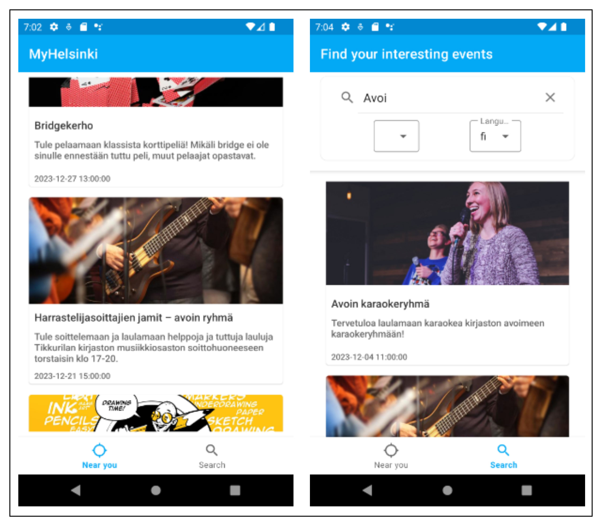
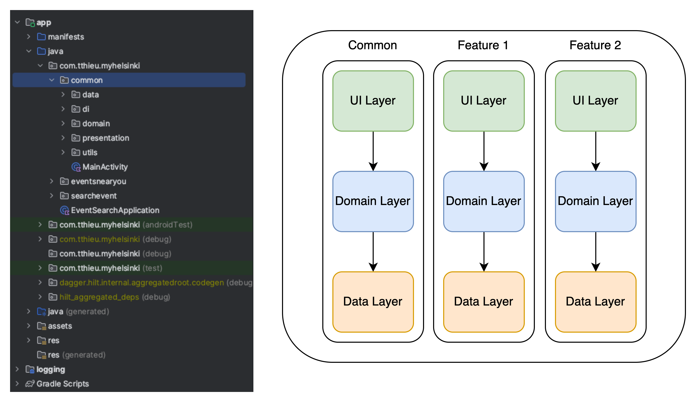
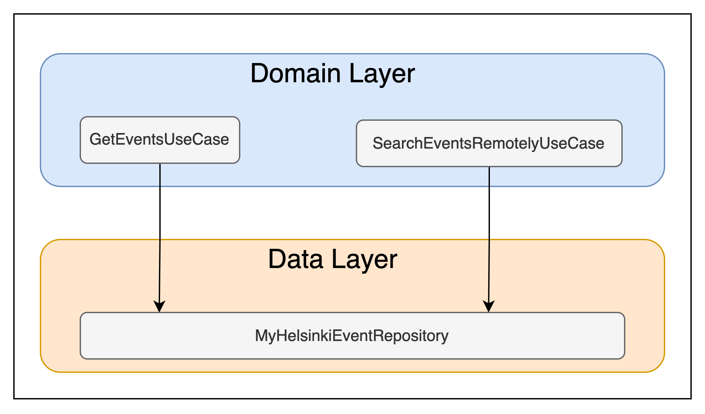
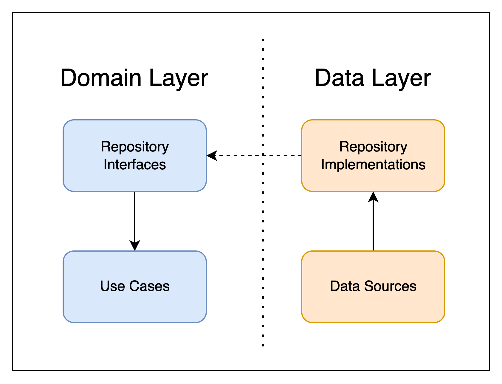
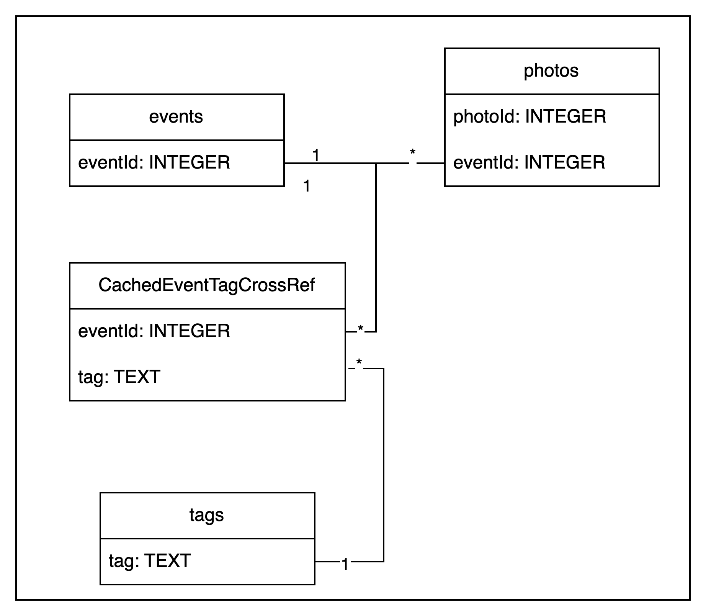
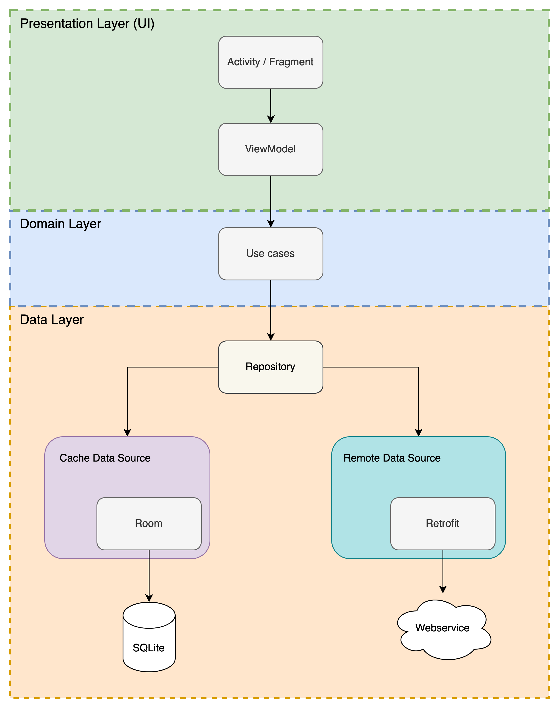

# My Helsinki Events 🎭

MyHelsinkiEvents is a sample app, built with Kotlin. The app for keeping up to date with the latest events in Helsinki. The goal of the sample is to showcase the use of ***clean architecture*** in Android.

## Screenshots

## Features
This sample contains 2 screens so far: the events near you screen, and the search screen.
 - **Events near you**: Display a list of events near you.
 - **Search**: Searches for an event by name, language.

## Architecture
The app connects to an external service, which it uses to fetch the Helsinki events. This service, [MyHelsinki Open API](https://open-api.myhelsinki.fi/doc), offers up-to-date information about places, events, and activities around Helsinki. However, this service will be [taken out of use by June 2023](https://open-api.myhelsinki.fi/) due to economic and technological reasons.

### Package structure
This project is organized in package by feature structure. Everything that's related to a feature, and only to that feature, is stored inside the same package. Code shared by two or more features is stored in separate common packages.

Each feature package will have three main packages:
 - **domain**: contain all the use cases, entities and value objects that describe the domain of the app.
 - **data**: this layer responsible for enabling all the interactions with data sources, both internal like database, and external like a remote API.
 - **presentation**: the Android framework (setting up the UI and reacting to user input)

---
### Domain layer 
This layer encompasses the business logic of the app, and protect the app's logic from external changes. There are two packages inside:
 - **model**: where all entities and value object live.
 - **repositories (common package)** : where repository interfaces.
 - **uses cases (feature package)**: each use case should only have responsibility over a single functionality.

---
### Data layer
The data layer is responsible for interacting with data sources: database, shared preferences, and network. This project follows the **repository pattern** recommended by Google.

**Network**

This project connects to the API with Retrofit.

**Caching**

Room is used to create the caching system. The entity relationship diagram is:

---
### Presentation layer
This layer encapsulates all the code related to the UI, holding all the UI-related components. In other words, this layer deals with framework code.

## Data
The events data in this sample is fetched from [MyHelsinki Open Api](https://open-api.myhelsinki.fi/doc). The app needs to work offline, so the data will need to be stored. Both a **cache data source** and a **network data source** will be used. 

The approach is to follow a **single source of truth** implementation. Keep the cache in sync with the network, but ensure that the UI accesses only the cache. This way, the app displays the latest data both on and offline.

